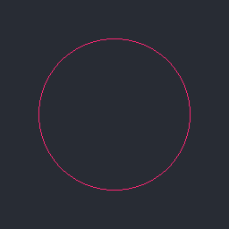

# Mid-Point Circle

Inspired by [tsoding/midpoint-circle-visualization](https://github.com/tsoding/midpoint-circle-visualization)

[PPM image format](https://en.wikipedia.org/wiki/Netpbm)

## Quick Start

```console
$ make
$ ./main
```
## Output

 


