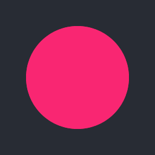

# C Graphical Context

Inspired by [tsoding/midpoint-circle-visualization](https://github.com/tsoding/midpoint-circle-visualization) & [tsoding/2mpeg4yuv](https://github.com/tsoding/2mpeg4yuv)

[PPM image format](https://en.wikipedia.org/wiki/Netpbm)

[YUV4MPEG2 video format](https://wiki.multimedia.cx/index.php?title=YUV4MPEG2)

## Quick Start

```console
$ sudo apt install libglfw3-dev libglew-dev
$ make
$ ./main
$ feh *.ppm --keep-zoom-vp --force-aliasing
$ mpv circle.y4m
% mpv putinWalk.y4m
$ ./main opengl
```
## Output (Converted to PNG & GIF)

Circle | Filled circle | AA filled circle | AA filled circles
:-:|:-:|:-:|:-:
 |  |  | 
